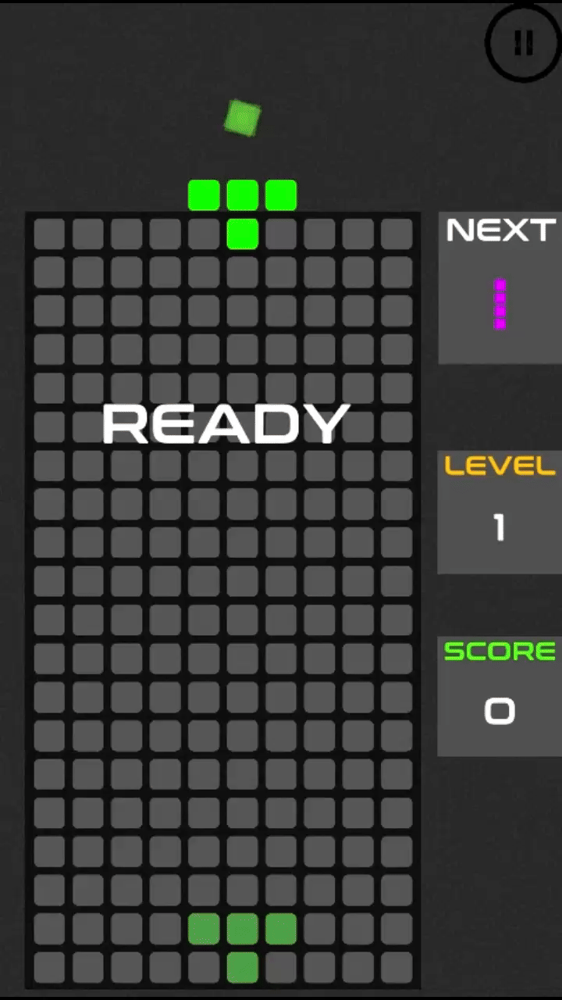
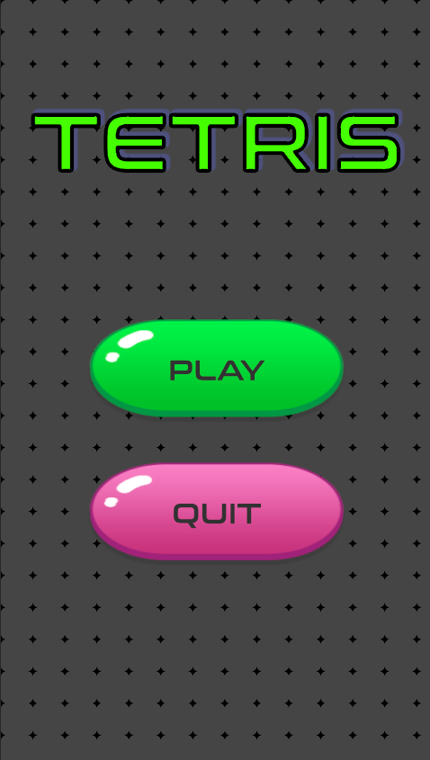
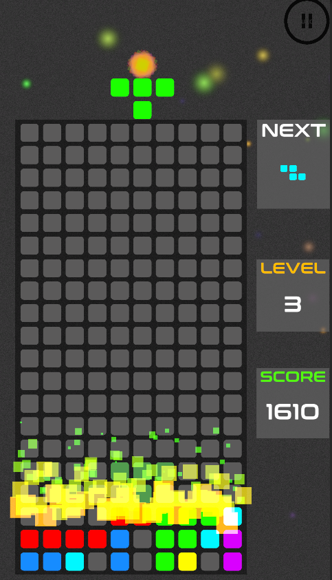

# Tetris Clone

> Classic tetris game

    

## Controls

Move block horizontally => Left and Right Arrows, 'A' and 'D' keys.

Rotate block => Up arrow, 'W' key

Move block vertically => Down arrow, 'S' key

## Screenshots

---

## Assets

### SFX

* [Horizontal Block Move](https://freesound.org/people/Mellau/sounds/506054/)
* [Block Move Error](https://freesound.org/people/obrymec/sounds/580830/)

---

### Background Music

1. 'Defense Matrix' by Vyra 🇧🇪 | Retro Music (No Copyright)

"Vyra - Defense Matrix" is under a Creative Commons license.
Music promoted by BreakingCopyright: http://bit.ly/2DQIVnI

2. Retro & Synthwave (Music For Videos) - "Odyssey" by John Tasoulas

"John Tasoulas - Odyssey" is under a Creative Commons (CC-BY 3.0) license
Music promoted by BreakingCopyright: https://bit.ly/bc-odyssey-song

3. Dark Suspense & Synthwave (Music For Videos) - "The Dead" by John Tasoulas

"John Tasoulas - The Dead" is under a Creative Commons (CC-BY 3.0) license  
Music promoted by BreakingCopyright: https://bit.ly/bc-the-dead-song

4. "Restabilized" by Punch Deck

"Restabilized" by Punch Deck is under a Creative Commons ( cc-by) license
Music promoted by BreakingCopyright

5. Kabbalistic Village - Fast and Furious

"Fast and Furious - Free Electronic Background music by Kabbalistic Village is licensed under a  Creative Commons License.
Music promoted by BreakingCopyright

---

### Fonts

https://www.dafont.com/conthrax.font

### Button Icons

[Play Button Icon](https://www.flaticon.com/free-icons/play-button)

[Pause Button Icon](https://www.flaticon.com/free-icons/pause)
